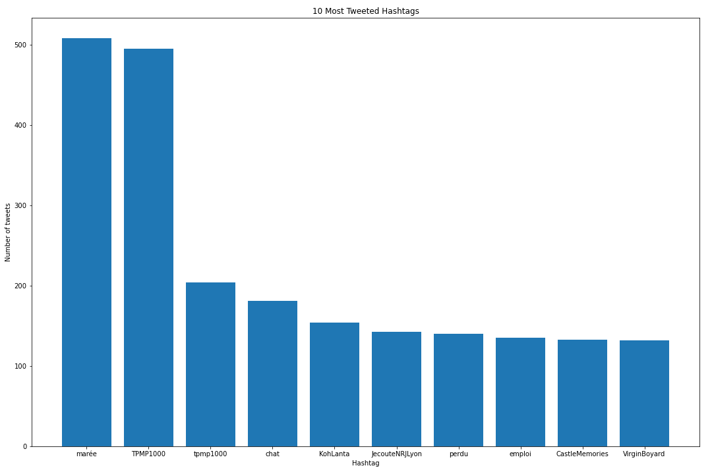

# FrenchTweets
Analysis of French Tweets surrounding the 2017 Presidential Election
## Data
The data is found [here](https://s3.us-east-2.amazonaws.com/jgartner-test-data/twitter/zippedData.zip)

scripts are written expecting the data to be in the /data directory

## Cleaning and Data Exploration
The tweet data was stored in a json file, which we pulled into a spark dataframe.  We then paired down the dataframe down to the columns with the most relevant information, such as the text, the date the tweet was posted, the user information, and country of origin.  

Upon viewing the text of a sample of the tweets, we noticed that a large portion of the tweets were completely irrelevant to the French election.  For example:

"Is yogurt associated with a lower cardiometabolic risk in children?"
"Working lunch in the back garden"

We filtered out the irrelevant tweets by creating another dataframe that only including tweets that include references to the election or its candidates (i.e. Macron, Le Pen, président, etc...) using the SQL LIKE feature.  This significantly shrunk the dataset from ~214,000 tweets to ~14,000 tweets  

## Graphs

### Graphs of hashtag frequencies
#### Hashtags from all tweets

#### Hashtags from selected filtered tweets

### Number of Tweets Referencing each Candidate

### Number of Tweets Referencing each Party

